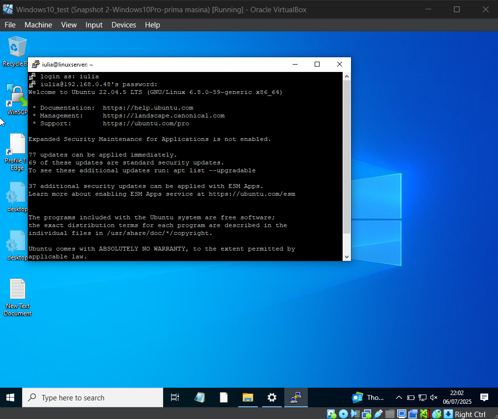

# Windows 10 Pro – Client Machine (VM1)

This virtual machine simulates a Windows 10 Pro client that was added to a local domain and configured to communicate with both a Windows Server and a Linux server. It is part of a larger virtualization project that includes three virtual machines.

## Domain Integration

The client was successfully added to the domain `proiect.local`. The full computer name was displayed as `win10.proiect.local`, confirming successful domain integration.

## Firewall Configuration

The Windows Defender Firewall was enabled and set to block all incoming connections that are not explicitly allowed. The client was connected to a Private network to ensure a trusted environment.

## Inbound Rules

Several custom inbound rules were configured to allow specific services and development tools:

- HTTP traffic
- Remote administration protocols (SSH, Telnet, Rlogin)
- File transfer protocols used by WinSCP (SFTP, FTP, SCP, WebDAV, etc.)

These rules were scoped based on the network profile.

## SSH Access with PuTTY

PuTTY was used to connect from the Windows client to the Linux server via SSH. A successful login was made using the Linux machine’s internal IP address.

## Secure File Transfer with WinSCP

WinSCP was installed and used to access the Linux server via SFTP. The connection was authenticated using the Linux user's credentials, and access to the home directory was confirmed.

## Summary

- Successfully joined the domain `proiect.local`
- Firewall properly configured with strict rules
- Remote access to Linux server verified through PuTTY
- File transfer capabilities tested with WinSCP

This machine demonstrates a standard Windows domain client with secure remote access and file-sharing capabilities in a mixed-OS environment.

