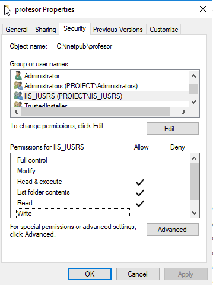

# Windows Server 2016 - Domain Controller (VM2)

This machine acts as a central server in the virtualization project. It runs Windows Server 2016 and is responsible for domain management, DNS configuration, Group Policies, file sharing, and hosting multiple websites.

## Active Directory and DNS

The server was configured with the **Active Directory Domain Services (AD DS)** and **DNS Server** roles. It serves the domain `proiect.local`.

The DNS Manager was configured to include `win10`, `server1`, and others under `proiect.local`. Host records were set correctly.

---

## Group Policy Objects (GPO)

Three main policies were configured and linked to the domain:

1. **Default Domain Policy**
2. **Politica_Sebi**
3. **Blocare_TaskManager_Sergiu**

### GPO: Politica_Sebi

This policy defines password policies:
- Enforce password history: 21 passwords remembered
- Max password age: 30 days
- Min password age: 29 days
- Min password length: 10 characters

### GPO: Blocare_TaskManager_Sergiu

This GPO disables the Task Manager for the user `sergiu`.

---

## User Accounts

Two users were created in Active Directory:
- `sergiu`
- `sebi`

Each user has custom properties. For example, the `sergiu` account is set to never expire, and has its password stored with reversible encryption.

---

## IIS Web Server with Two Sites

Two websites were created and hosted using IIS:
- `profesor.com`
- `student.ro`

Each site is bound to port 80 and to the local IP `192.168.0.10`.

### IIS Sites Overview

### Site Bindings

**profesor.com**

**student.ro**

### Website Display in Browser

The `student.ro` page was loaded successfully in a browser.

---

## File System Permissions

### profesor.com folder permissions

### student.ro folder permissions

---

## Summary

This server was successfully configured with:
- Domain controller and DNS roles
- User accounts and Group Policies
- Two functional websites with proper bindings and file permissions

It serves as the core of the infrastructure for the project and interacts with both the client (VM1) and Linux server (VM3).

