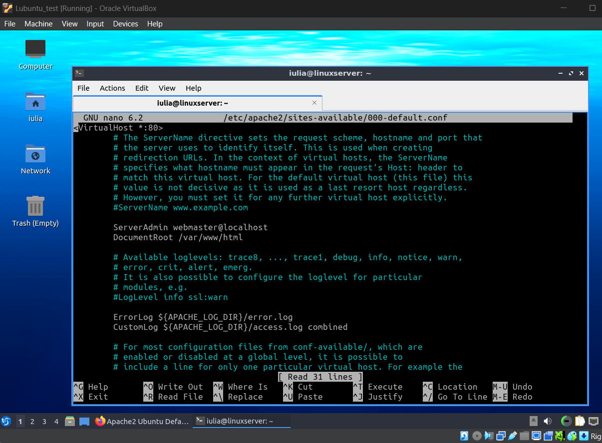
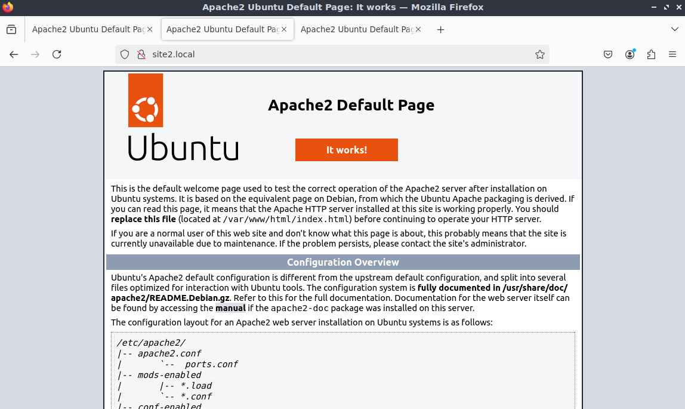
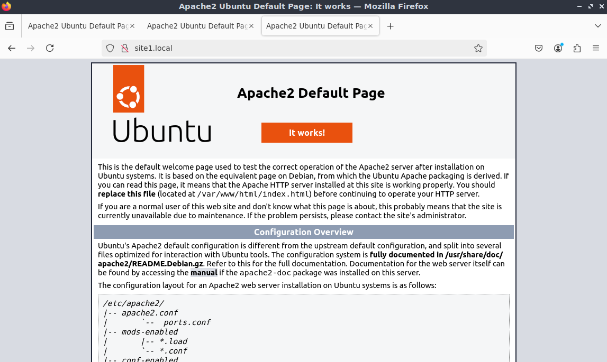
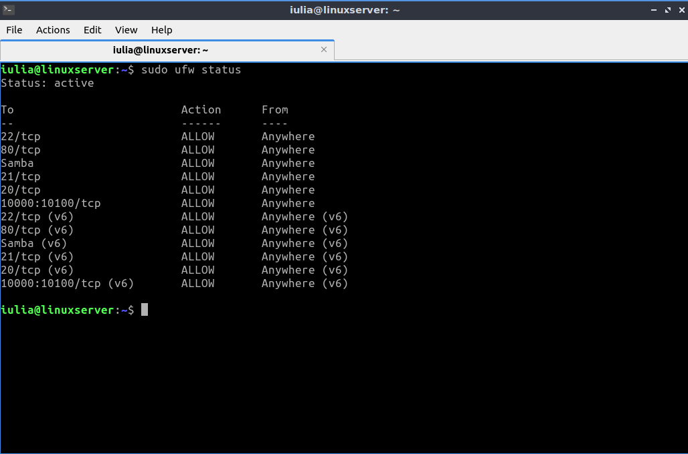
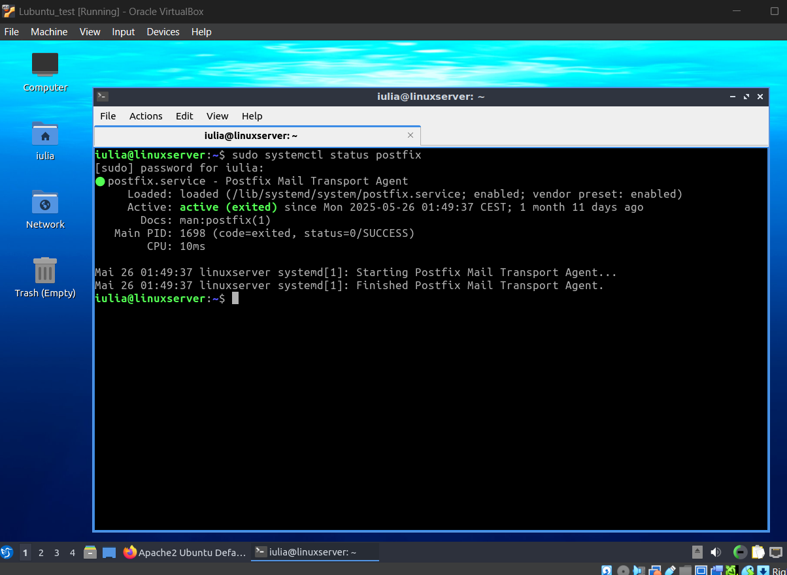
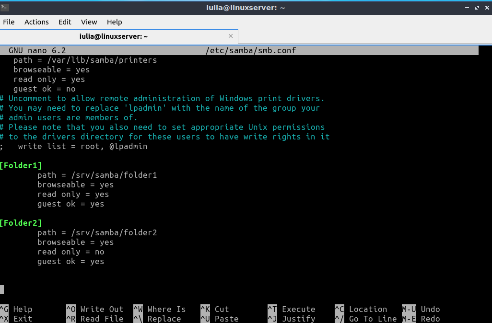
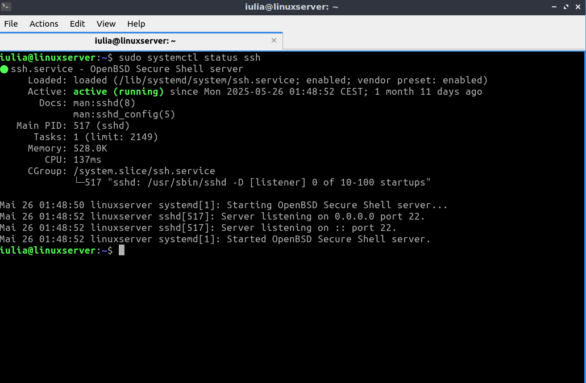
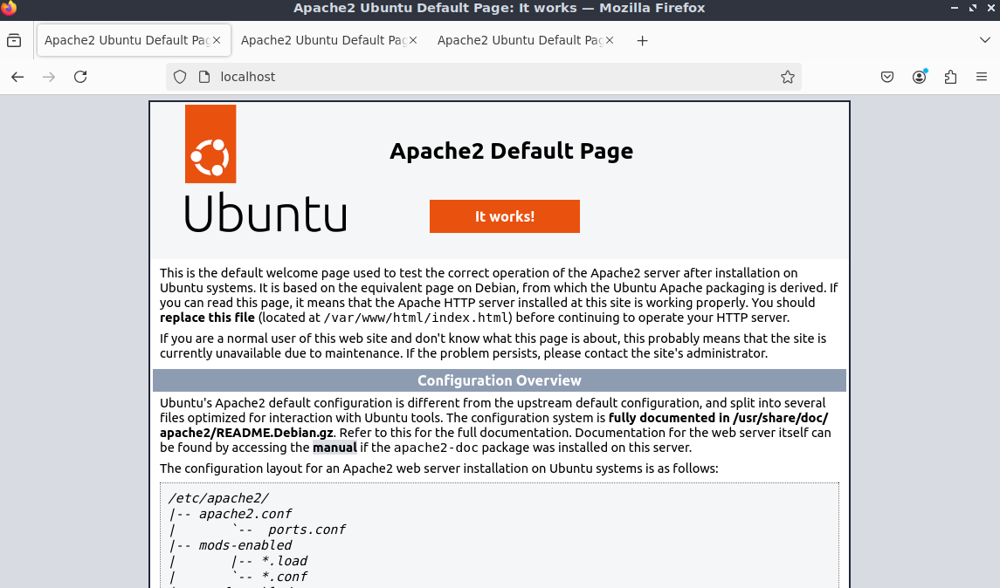
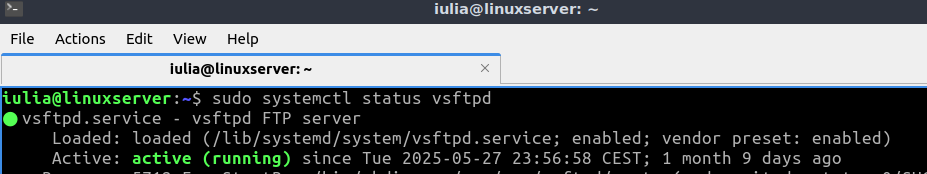

# VM3 – Linux Server (Lubuntu)

This virtual machine is based on Lubuntu and was configured as a lightweight Linux server providing multiple essential services. It is part of a broader virtualization project with three VMs (Windows 10 client, Windows Server, and this Linux server).

---

## 1. Apache2 Web Server

Apache2 was installed and configured as the primary web server. The default site loads successfully in the browser, confirming the setup is functional.



Main config file edited:  
`/etc/apache2/sites-available/000-default.conf`  
DocumentRoot: `/var/www/html`

---

## 2. Two Virtual Hosts – `site1.local` and `site2.local`

Two local websites were configured and tested successfully using Apache virtual hosts. Both domains resolve correctly and display the default page:

  


---

## 3. Firewall – UFW

UFW is enabled and allows traffic for all relevant services: HTTP, FTP, SSH, Samba, and Webmin.



Allowed ports:
- 22/tcp – SSH  
- 80/tcp – HTTP  
- 20, 21/tcp – FTP  
- Samba  
- 10000:10100/tcp – Webmin  

---

## 4. Postfix – Mail Server

Postfix is installed and configured as a basic mail transport agent.  
It starts correctly and exits cleanly, indicating it's set up properly.



---

## 5. Samba – File Sharing

Two shared folders are configured via Samba:

📁 `folder1` – read-only  
📁 `folder2` – read/write

Config file: `/etc/samba/smb.conf`



```ini
[Folder1]
   path = /srv/samba/folder1
   browseable = yes
   read only = yes
   guest ok = yes

[Folder2]
   path = /srv/samba/folder2
   browseable = yes
   read only = no
   guest ok = yes
```

---

## 6. SSH – Secure Remote Access

OpenSSH server is installed and running. The server listens on the default port (22) and is reachable for remote administration.



---

## 7. Default Apache Page (localhost)

Tested locally to verify Apache was serving content correctly from the default directory.



---

## 8. FTP Server – vsftpd

vsftpd is installed, enabled, and running as an FTP server for basic file transfer operations.



---

## Summary

This VM was configured as a small, multipurpose Linux server using Lubuntu. It includes all the essential services needed in a basic network setup: a working web server with two virtual hosts (Apache2), file sharing via Samba, SSH access, a basic mail system with Postfix, and an FTP server. I also configured the firewall (UFW) to allow only the necessary traffic.

Every service was installed and tested manually. I made sure each one worked as intended, either by accessing it from a browser or through terminal commands. The configuration process helped me understand how a Linux machine can provide multiple services in parallel, and how these can be integrated into a larger network that also includes Windows systems.


---

All configurations were done manually via terminal and verified via browser or CLI tools.  
The goal was to simulate a real-world scenario where a Linux VM hosts essential infrastructure services in a small network.

